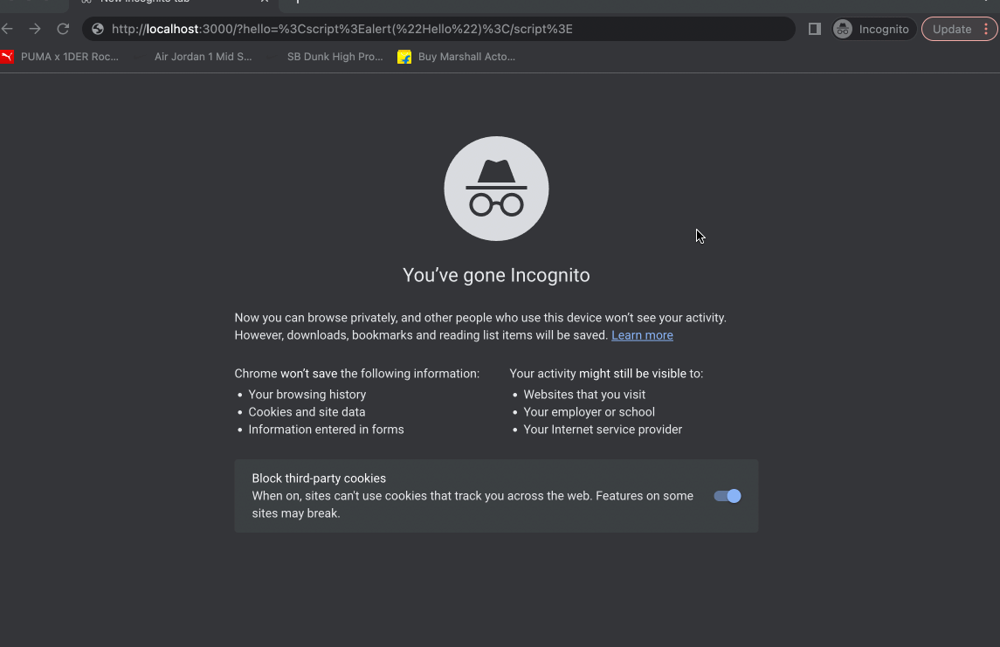

<div align="center">
  
</div>

<br>

<h1 align="center">XSS Safeguard</h1>

<p align="center">Performance oriented safeguard for all possible XSS attacks
</p>

<h6 align="center">Made with ❤️ by developers for developers</h6>

<br>
<p align="center">


</p>

## Want to show your love?

<p>Click on 🌟 button.</p>

## Table of Contents

- [Want to show your love?](#want-to-show-your-love)
- [Table of Contents](#table-of-contents)
- [Installation](#installation)
- [Features](#features)
- [Usage](#usage)
- [FAQ](#faq)
  - [Is it supported and tested both on web and mobile?](#is-it-supported-and-tested-both-on-web-and-mobile)
- [Contributing](#contributing)
  - [Step 1](#step-1)
  - [Step 2](#step-2)
  - [Step 3](#step-3)
- [Support](#support)
- [License](#license)

## Installation

```bash
$ yarn add @mohalla-tech/xss-safeguard
```

OR

```bash
$ npm i @mohalla-tech/xss-safeguard --save
```

## Features

- URL sanitization (With express middleware for SSR) :100:
- Query Param Sanitization (Client Side) :100:
- String Sanitization :100:
- Input Sanitization :100:

## Usage

Express Middleware for SSR

```ts
import express from 'express';
import { secure } from '@mohalla-tech/xss-safeguard';

const app = express();

// Default configuration
app.use(secure());

// Callback on xss attack
app.use(secure({ callback: () => {} }));

// Custom response handler when xss attack happens
app.use(
  secure({
    handleResponseCustom: res => {
      res.redirect('/error');
    },
  })
);
```

Query Param Sanitization

```ts
import { getSafeSearchParam } from '@mohalla-tech/xss-safeguard';

// URL : https://sharechat.com?language=en
const sanitizedString = getSafeSearchParam('language');
console.log(sanitizedString); // en

// URL : https://sharechat.com?language=<script>alert("Hello")</script>
const sanitizedString = getSafeSearchParam('language');
console.log(sanitizedString); // scriptalertHello/script
```

String Sanitization

```ts
import { sanitizeString } from '@mohalla-tech/xss-safeguard';

const sanitizedString = sanitizeString('<script>Hello</script>');
console.log(sanitizedString);
```

## FAQ

### Is it supported and tested both on web and mobile?

Yes

## Contributing

> To get started...

### Step 1

- **Option 1**

  - 🍴 Fork this repo!

- **Option 2**
  - 👯 Clone this repo to your local machine using `https://github.com/ShareChat/xss-safeguard`

### Step 2

- **HACK AWAY!** 🔨🔨🔨

### Step 3

- 🔃 Create a new pull request using <a href="https://github.com/ShareChat/xss-safeguard" target="_blank">`https://github.com/ShareChat/xss-safeguard`</a>.

## Support

Reach out to one of the following:

- garganurag893@gmail.com
- sumit07sinha@gmail.com
- himandwivedi@gmail.com
- satishshriwasofficial@gmail.com

## License

[](http://badges.mit-license.org)

- **[MIT license](http://opensource.org/licenses/mit-license.php)**
